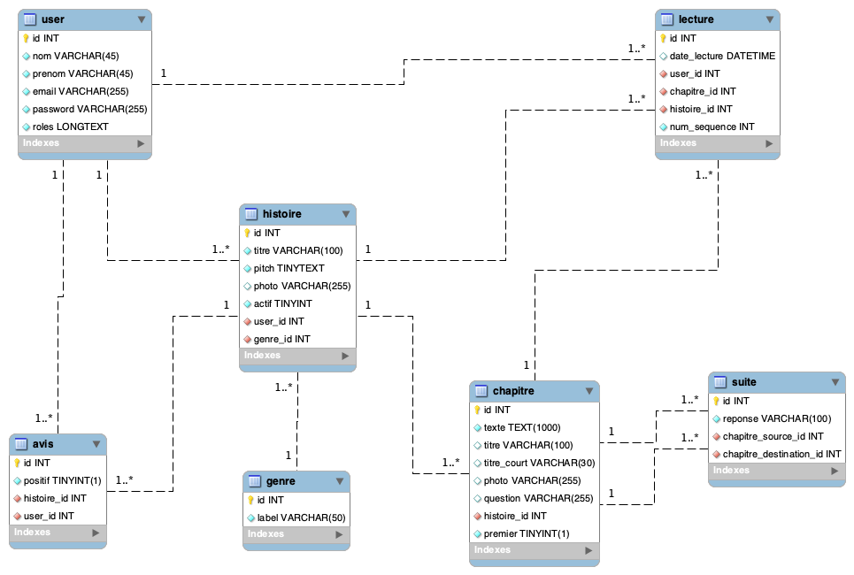

# Projet Marathon Symfony

*   Le projet contient une base Symfony 4.2
*   Les entités du système d'information données dans la figure suivante :

     

*   Un contrôleur `SecurityController` qui contrôle l'accès aux pages protégées.
*   Un contrôleur `RegistrationController` qui permet d'ajouter un utilisateur.
*   Un contrôleur `VisualisationController` qui affiche la page d'accueil.
*   Un contrôleur `CreationController` qui permet de 
    -   Créer une histoire (après connexion).
    -   Créer un chapitre (après connexion).
    -   Créer une liaison entre chapitres (après connexion).
    
# Configuration

*   Le fichier `.env` contient les informations pour utiliser la base de données sur la machine **`marathon`**.
    Si vous souhaitez utiliser votre propre base de données pendant la phase de développement, faites une
    copie du fichier `.env` dans un fichier `.env.local` et modifiez les informations de connexion pour utiliser votre base de données.
    
*   Pour tester l'application
    -   `composer install` pour récupérer les librairies
    -   `cp .env .env.local` puis édition du fichier `.env.local` pour indiquer les informations de connexion à votre base de données
    -   `php bin/console server:start` pour lancer l'application
    
# initialiser la base de données

*   Pour créer les tables dans la base de données :
    ```bash
    php bin/console doctrine:migrations:migrate
    ```    
*   Pour mettre des données dans les tables

    ```bash
    php bin/console doctrine:fixtures:load
    ```
    Cette dernière commande ajoute deux utilisateurs (voir le fichier `src/DataFixtures/AppFixtures.php`) :
    
    -   Robert Duchmol Robert.duchmol@marathon.com mdp : secret
    -   Isaac Asimov    asimov@gmail.com mdp : secret
    
    et Deux histoires
    
    -   z1 ou la vie d'un demi-octet
    -   THX1138
    
# Utilisation de la commande git

*   Toujours faire un `git pull` avant de faire un `git push` pour éviter les conflits ...
    
 